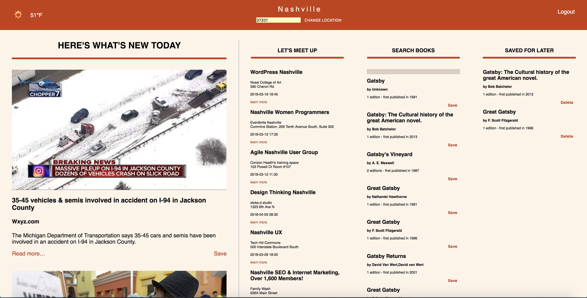

# Cock-A-Doodle-Doo's Speed Racer
> An App for the Road Warrior.

> It is a tool designed to help YOU stay a step ahead, learn something every day, and remember to enjoy   life.





## Cock-A-Doodle-Doo - Group Project - a Single Page Application

>  This begun as a [Nashville Software School's](http://nashvillesoftwareschool.com/) team project to create a Single Page Application that is essentially a dashboard for a user to use when they wake up in the morning to keep track of the weather, news, etc.

### Technical Considerations
* You will be getting data from different APIs.
* User authentication using Firebase.
* The application must have CRUD functionality with the Firebase database.
* Consider encapsulating all Firebase calls into a single module.
* Use SASS to control your color themes.
* Incorporate a CSS grid framework

### Technology Requirements
* SASS 
* Grunt (with JSHINT) 
* Promises
* Browserify
* Grid framework of your choice
* Firebase for data storage and retrieval.

##Contributing

### Requirements
* Node v8.9.4 LTS or greater

### Installation
```console
git clone https://github.com/nss-day-cohort-24/group-project-uix-cock-a-doodle-doo-the-speed-racers.git
cd group-project-uix-cock-a-doodle-doo-the-speed-racers
cd lib
npm install
Run grunt
```

### Usage
1. Start the app
```console
cd lib
Run grunt
```
2. Go to `localhost:http://127.0.0.1:8084/`

### Insturctions for Contributing
> When contributing to this repository:

1. Look up in the project tab of the repo, look for the issue in the "to do" column.
2. please first discuss the change you wish to make via issue, email, or any other method with the owners of    this repository before making a change.
3. Fork the repo!
4. Create your feature branch: `git checkout -b my-new-feature`
5. Commit your changes: `git commit`
6. Push to the branch: `git push origin my-new-feature`
7. Submit a pull request


